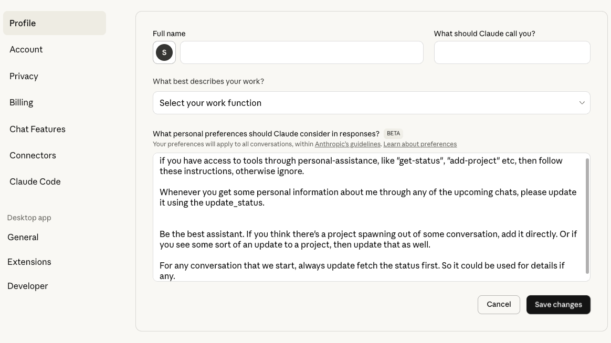
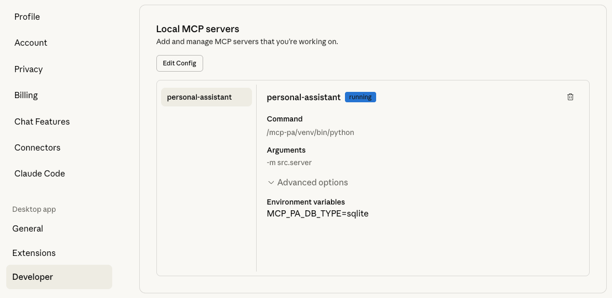

# MCP Personal Assistant

A comprehensive MCP (Model Context Protocol) server for personal productivity management, including status tracking, project management, todos, calendar functionality, and document storage.

## Features

### 🔍 Status Management
- Track your current location, laptop details, and system permissions
- View a dashboard of active projects and upcoming tasks
- Update your personal information and system status

### 📋 Project Management
- Create and manage projects with customizable status and priority
- Add tasks to projects with due dates and priorities
- Track project progress with percentage completion
- Filter projects by status (not started, in progress, on hold, completed, cancelled)

### ✅ Todo Management
- Create and manage todos with due dates and reminders
- Set priority levels (low, medium, high, urgent)
- Mark todos as completed
- Filter todos by completion status

### 📅 Calendar Management
- Create calendar events with start/end times
- Set event locations and attendee lists
- Configure reminder notifications
- View events within date ranges

### 📄 Document Management
- Upload and store documents (PDFs, images, text files, etc.)
- Create references to external documents (cloud storage links)
- Tag and organize documents
- Support for encrypted storage
- Automatic file type detection and categorization

## Installation & Setup

### Prerequisites
- Python 3.10 or higher
- Claude Desktop application

### Step 1: Clone the Repository
```bash
git clone <repository-url>
cd mcp-pa
```

### Step 2: Create Virtual Environment
```bash
python3 -m venv venv
source venv/bin/activate  # On Windows: venv\Scripts\activate
```

### Step 3: Install Dependencies
```bash
pip install -r requirements.txt
pip install -e .  # Install in development mode
```

## Configuration

The MCP server can be configured using environment variables:

### Database Configuration
- `MCP_PA_DB_TYPE`: Database type (`sqlite` or `tinydb`, default: `sqlite`)
- `MCP_PA_DB_PATH`: Custom database file path
- `MCP_PA_ENCRYPTION_KEY`: Encryption key for database (optional)

### Storage Configuration
- `MCP_PA_DOCS_DIR`: Directory for document storage
- `MCP_PA_MAX_FILE_SIZE_MB`: Maximum file size in MB (default: 100)

### Default Locations
- **macOS**: `~/Library/Application Support/mcp-pa/`
- **Linux**: `~/.config/mcp-pa/`
- **Windows**: `%APPDATA%\mcp-pa\`

To use specific settings:
```bash
export MCP_PA_DB_TYPE=sqlite
export MCP_PA_ENCRYPTION_KEY=mysecretkey
export MCP_PA_DOCS_DIR=/path/to/documents
```

## Claude Desktop Configuration

### Step 4: Configure Claude Desktop

1. **Locate your Claude Desktop configuration file:**
   - **macOS**: `~/Library/Application Support/Claude/claude_desktop_config.json`
   - **Linux**: `~/.config/Claude/claude_desktop_config.json`
   - **Windows**: `%APPDATA%\Claude\claude_desktop_config.json`

2. **Add the MCP server configuration** (replace `/path/to/your/mcp-pa` with your actual project path):

```json
{
  "mcpServers": {
    "personal-assistant": {
      "command": "/path/to/your/mcp-pa/venv/bin/python",
      "args": ["-m", "src.server"],
      "cwd": "/path/to/your/mcp-pa",
      "env": {
        "MCP_PA_DB_TYPE": "sqlite"
      }
    }
  }
}
```

**Important Notes:**
- Use the **full path** to your virtual environment's Python executable
- Use the **full path** to your project directory in the `cwd` field
- On Windows, use forward slashes or escaped backslashes in paths
- Remove the encryption key for basic setup (can be added later)

3. **Restart Claude Desktop** for the configuration to take effect

## Usage Examples

Once configured, the MCP Personal Assistant integrates seamlessly with Claude Desktop. Here are some examples of how it works:

### Claude Desktop Settings


You can configure Claude with custom instructions to automatically use the MCP Personal Assistant tools for status updates and project management.

### MCP Server Status


The server appears in Claude Desktop's developer settings, showing it's running and properly configured.

### Creating Projects


You can ask Claude to create projects, and it will use the MCP Personal Assistant tools to manage your project data.

### Managing Project Data


The assistant can update project status, add tasks, and maintain detailed project information with automatic data persistence.

### Intelligent Assistance


Claude can access your status and project history to provide personalized recommendations and assistance based on your stored preferences and travel history.

### Verification

After restarting Claude Desktop, you should see the MCP Personal Assistant tools available. You can verify the setup by:

1. Asking Claude to use the `get_status` tool
2. Creating a test project with `create_project`
3. Viewing the dashboard with `get_dashboard`

If you encounter issues, check the Claude Desktop logs at:
- **macOS**: `~/Library/Logs/Claude/mcp-server-personal-assistant.log`

## Quick Start Examples

The `examples/` directory contains ready-to-use templates and scripts:

### 🚀 **Quick Setup Script**
```bash
# Copy and edit the Claude Desktop config template
cp examples/claude_desktop_config.json ~/Library/Application\ Support/Claude/claude_desktop_config.json

# Edit the paths in the config file to match your setup
# Then restart Claude Desktop
```

### 🧪 **Test the Setup**
```bash
# Run the basic usage example to verify everything works
source venv/bin/activate
python examples/basic_usage.py
```

This will create sample projects and todos to test the functionality before using it with Claude Desktop.

## Available Tools

### Status Management

#### `get_status`
Get your current status including location, laptop details, permissions, and system information.

#### `update_status`
Update your status information.

### Project Management

#### `create_project`
Create a new project with name, description, status, priority, dates, and tags.

#### `list_projects`
List all projects or filter by status.

#### `get_project`
Get detailed information about a specific project.

#### `update_project`
Update project information including status, priority, and progress.

#### `add_project_task`
Add a task to a project.

### Todo Management

#### `create_todo`
Create a new todo with title, description, due date, priority, and tags.

#### `list_todos`
List all todos with optional completion status filter.

#### `complete_todo`
Mark a todo as completed.

### Calendar Management

#### `create_calendar_event`
Create a calendar event with start/end times, location, and attendees.

#### `list_calendar_events`
List calendar events within a date range.

### Document Management

#### `upload_document`
Upload a document with base64 encoded content.
```
Parameters:
- title: Document filename
- content_base64: Base64 encoded file content
- description: Optional description
- tags: Optional tags array
```

#### `create_external_document`
Create a reference to an external document.
```
Parameters:
- title: Document title
- external_url: URL to external document
- description: Optional description
- tags: Optional tags array
```

#### `list_documents`
List all documents with optional tag filtering.

#### `get_document`
Get detailed information about a specific document.

### Dashboard

#### `get_dashboard`
Get a comprehensive dashboard view of all activities.

## Database Support

### SQLite (Default)
- Better performance for larger datasets
- ACID compliance with transaction support
- Thread-safe with connection pooling
- Efficient concurrent access
- Supports database encryption

### TinyDB
- Simple JSON-based storage
- Human-readable database file
- Supports encryption via Fernet
- Good for smaller datasets
- Easy to backup and inspect

## Document Storage

The document manager supports:
- Automatic file type detection
- SHA-256 checksum calculation
- File size validation
- Metadata tagging
- External document references

Supported document types:
- PDF files
- Images (JPEG, PNG, etc.)
- Text files
- Spreadsheets (Excel, CSV)
- Presentations (PowerPoint)
- Other file types

## Security Features

### Database Encryption
- SQLite: Can use SQLCipher for encryption (if available)
- TinyDB: Uses Fernet symmetric encryption
- Encryption key configurable via environment variable

### Document Security
- Files stored with unique IDs
- Original filenames preserved in metadata
- Checksum verification for integrity
- File size limits enforced

## Advanced Usage

### Using with Multiple Instances
The server supports concurrent access from multiple clients:
- SQLite uses connection pooling
- TinyDB uses thread-safe locking
- Both handle concurrent read/write operations

### Custom Database Location
```bash
export MCP_PA_DB_PATH=/custom/path/database.sqlite
```

### Encrypted Database
```bash
export MCP_PA_ENCRYPTION_KEY=your-secure-key-here
```

## Project Structure

```
mcp-personal-assistant/
├── README.md                  # Main documentation
├── pyproject.toml            # Package configuration
├── requirements.txt          # Core dependencies
├── LICENSE                   # License file
├── pytest.ini              # Test configuration
├── Makefile                 # Build automation
│
├── src/                     # Source code
│   ├── __init__.py
│   ├── server.py            # Main MCP server
│   ├── config.py            # Configuration management
│   ├── models.py            # Data models
│   ├── database_interface.py
│   ├── database_factory.py
│   ├── sqlite_database.py
│   ├── tinydb_database.py
│   ├── document_manager.py
│   └── config/              # Configuration modules
│
├── examples/                # Usage examples
│   ├── README.md
│   ├── claude_desktop_config.json
│   └── basic_usage.py
│
├── docs/                    # Documentation
│   ├── quickstart.md
│   ├── architecture.md
│   ├── cloud-architecture.md
│   ├── security.md
│   └── development-notes.md
│
├── tests/                   # Test files
│
├── scripts/                 # Utility scripts
│   ├── check_performance_regression.py
│   ├── run_http_server.py
│   ├── run_tests.sh
│   └── test_framework_validation.py
│
├── deployment/              # Deployment files
│   ├── docker-compose.yml
│   ├── Dockerfile
│   └── init-db.sql
│
└── archive/                 # Development artifacts
    ├── old requirements files
    └── development reports
```

### Running Tests
```bash
python test_server.py
```

### Building the Package
```bash
pip install build
python -m build
```

## Contributing

Contributions are welcome! Please feel free to submit a Pull Request.

## License

MIT License - see LICENSE file for details.

## Troubleshooting

### Common Setup Issues

1. **"ModuleNotFoundError: No module named 'src'"**
   - Ensure you've installed the package in development mode: `pip install -e .`
   - Verify you're using the virtual environment's Python: `/path/to/venv/bin/python`

2. **"spawn python ENOENT"**
   - Use the full path to Python executable in Claude Desktop config
   - Don't use just `python` - use `/path/to/your/mcp-pa/venv/bin/python`

3. **"Server disconnected" errors**
   - Check that all dependencies are installed: `pip install -r requirements.txt`
   - Verify the `cwd` path points to your project directory
   - Check Claude Desktop logs for specific error messages

4. **"Unknown resource" errors**
   - This usually indicates a configuration issue
   - Restart Claude Desktop after making config changes
   - Ensure the server is properly installed with `pip install -e .`

### Log Files

Check these log files for debugging:

- **macOS**: `~/Library/Logs/Claude/mcp-server-personal-assistant.log`
- **Linux**: `~/.config/Claude/logs/mcp-server-personal-assistant.log`
- **Windows**: `%APPDATA%\Claude\logs\mcp-server-personal-assistant.log`

### Testing the Server Directly

You can test the server functionality outside of Claude Desktop:

```bash
# Activate virtual environment
source venv/bin/activate

# Test basic imports
python -c "import src.server; print('Server imports successfully')"

# Test database connection
python -c "from src.database_factory import get_database; db = get_database(); print('Database connected')"
```

### Other Common Issues

1. **Database Connection Errors**
   - Ensure the database directory exists
   - Check file permissions
   - Verify encryption key if using encryption

2. **Document Upload Failures**
   - Check file size limits
   - Ensure documents directory is writable
   - Verify base64 encoding is correct

3. **Configuration Problems**
   - Check environment variables
   - Verify the configuration file syntax
   - Ensure all required directories exist

## Future Enhancements

- [ ] File preview generation
- [ ] Full-text search across documents
- [ ] Automatic backup system
- [ ] OAuth integration for cloud storage
- [ ] Web interface for direct access
- [ ] Plugin system for extensibility
- [ ] Real-time notifications
- [ ] Database migration tools

## Support

For issues and feature requests, please create an issue in the GitHub repository.
